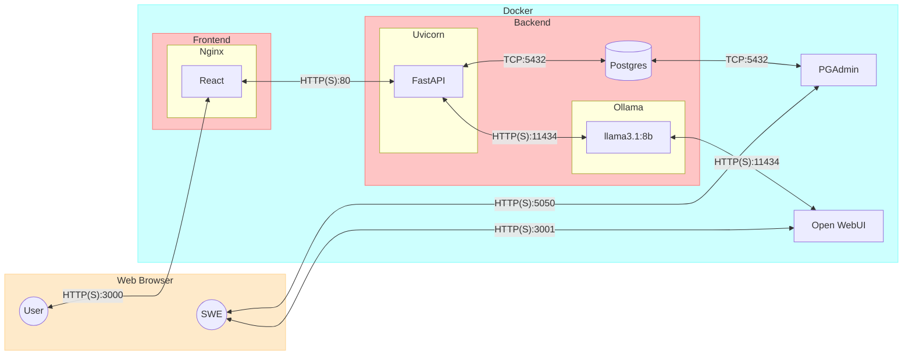

# Gut Theory

## Summary

- GutTheory is an AI enabled service that helps people manage their gut health

## Architecture



## Frontend

- Built with ```javascript```
- Local development with ```vite (js + swc)```
- UI + web server: [react/nginx](react/README.md)

## Backend

- Built with ```python```
- Unit testing with ```pytest```
- API + web server: [fastapi/uvicorn](fastapi/README.md)
- Relational db: [postgresql](postgres/README.md)
- Relational db mgr: pgadmin [pgadmin](pgadmin/README.md)
- Language model (llm): [llama3.1:8b](https://ollama.com/library/llama3.1)
- Language model host: [ollama](https://ollama.com/)

## Run the app

1. Navigate to the ```GutTheory``` folder

```sh

cd ./GutTheory

```

2. Use the file ```.template.env``` to create a ```.env``` file

```sh

cp ./.template.env ./.env

```

3. Fill in any missing environment variables in ```.env```

4. Compose up with an image/container (re)build

```sh

docker compose up -d --build --force-recreate

```

5. Navigate to the different components of the app

|Component Name|Link|
|--|--|
| API | localhost:80 |
| API Docs | localhost:80/docs |
| DB | localhost:5432 |
| PG Admin | localhost:5050 |
| UI | localhost:3000 |
| LM UI | localhost:3001 |
| LM API | localhost:11434 |

## Docker

Our Postgres instance runs in a docker container. Docker is a service for containerizing application. 
Containers allow you to package your software and dependencies together so they run quickly and reliably.

- Dependencies for example: the opperating system is a dependency for Chrome

- Having python installed is a dependency for FastAPI, the webserver Uvicorn is also a dependency for FastAPI

Multiple containers can run on a single machine with each container running as an isolated process. Containers can share the OS kernel on a single machine allowing you to host tons of light weight applications that are slimmed down a scalable.
Read more about containers on [docker's website](https://www.docker.com/resources/what-container/)

## Docker Desktop

Docker Desktop is a desktop application (go figure) that provides a GUI to manage containers on your local device.
You should download docker desktop from [docker's website](https://www.docker.com/) so you can easily manage containers running on your computer.

## Docker Compose

We're using Docker Compose for brevity. docker Compose is an abstraction on top of docker that allows you to define multiple containers in a single file as a group of services. You can also define dependencies for different services so that container start in-order. You can read more about docker compose in the [official docs](https://docs.docker.com/compose/).